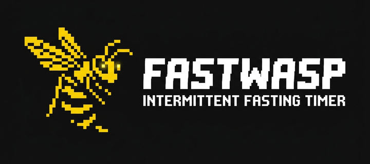
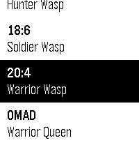
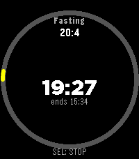

# FastWasp 🐝

> *Intermittent fasting on your wrist. With a sting.* ⏱️

A glanceable, native intermittent-fasting tracker for the new Pebble devices from Core Devices. Everything lives on the watch — no companion app, no accounts, no internet. 📴

---

## ✨ Features

- ⏳ **6 fasting programs** — 12:12, 14:10, 16:8, 18:6, 20:4, and OMAD
- 🍽️ **Tracks fast + eating window + OMAD** intervals
- 🔥 **OVERTIME counter** — keeps counting up past your target until you explicitly stop
- 📳 **Wrist alerts** — wakeups + vibration when your target is reached, even if the app is closed
- ✏️ **Edit start time** — nudge by ±15 minutes if you forgot to start on time
- 📊 **Stats screen** — total fasts, average length, longest fast, total overtime
- ⚙️ **Settings** — vibration toggle, reset data
- 🔒 **100% offline** — all data stored locally in watch persistent storage

## 📸 Screenshots

| Programs | Active fast |
|----------|-------------|
|  |  |

---

## ⌚ Supported devices

| Device | Platform | Display |
|--------|----------|---------|
| Core 2 Duo | `diorite` | 144×168 B&W |
| Pebble Time 2 | `emery` | 200×228 colour |
| Pebble Time / Time Steel | `basalt` | 144×168 colour |

---

## 🚀 Install

Grab the latest `pebble.pbw` from the [Releases page](../../releases) and sideload it via the Pebble app, or wait for it to land on the [Rebble App Store](https://apps.rebble.io). 📦

---

## 🛠️ Build from source

Requires Docker (uses the official `rebble/pebble-sdk` image):

```bash
docker run --rm -v "$PWD:/pebble" -w /pebble rebble/pebble-sdk bash -c "pebble build"
```

Output lands at `build/pebble.pbw`. The same workflow runs in GitHub Actions on every push. 🤖

To deploy directly to a phone-connected watch:

```bash
./deploy.sh <phone-ip>
```

---

## 📖 Docs

- [SPECS.md](SPECS.md) — full functional specification
- [store/](store/) — store assets (icon, banner, screenshots)

---

## 📝 License

Copyright © 2025 Grzegorz Lachowski. Licensed under the Apache License 2.0.
